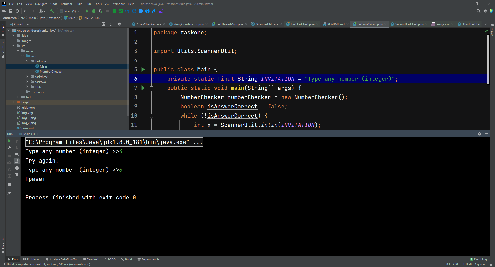
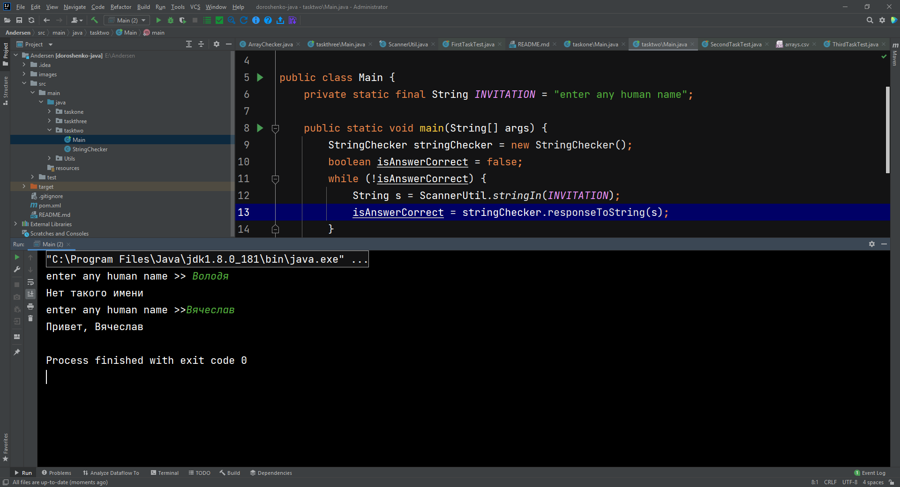
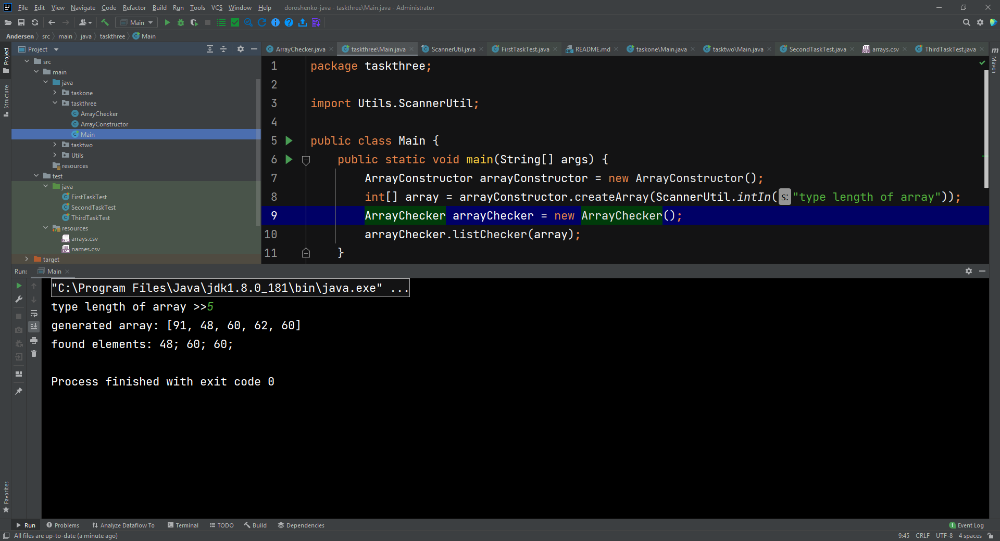
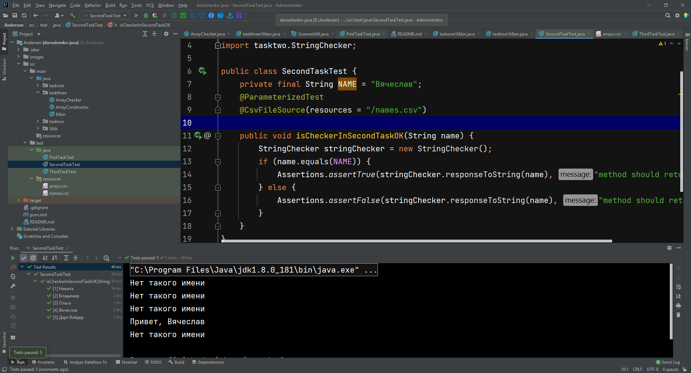

# README
# Task   
Необходимо написать код:

1. Составить алгоритм: если введенное число больше 7, то вывести “Привет”
2. Составить алгоритм: если введенное имя совпадает с Вячеслав, то вывести “Привет, Вячеслав”, если нет, то вывести "Нет такого имени"
3. Составить алгоритм: на входе есть числовой массив, необходимо вывести элементы массива кратные 3
4. Задание, ответ в текстовой форме:

Дана скобочная последовательность: [((())()(())]]
- Можно ли считать эту последовательность правильной?
- Если ответ на предыдущий вопрос “нет” - то что необходимо в ней изменить, чтоб она стала правильной?

# Решения
* задача номер 1 [решение. точка входа](src/main/java/taskone/Main.java)
* задача номер 2 [решение. точка входа](src/main/java/tasktwo/Main.java)
* задача номер 3 [решение. точка входа](src/main/java/taskthree/Main.java)
* тесты (Junit5) к алгоритмам располагаются [здесь](src/test/java) 
* задача номер 4. Ответ: скобочная последовательность невалидна.   
Необходимо убрать первую круглую открывающую скобку и предпоследнюю (или последнюю) квадратную закрывающую.   
таким образом, окончательный вариант будет таким:   
[(())()(())]

# Successful screenshots

